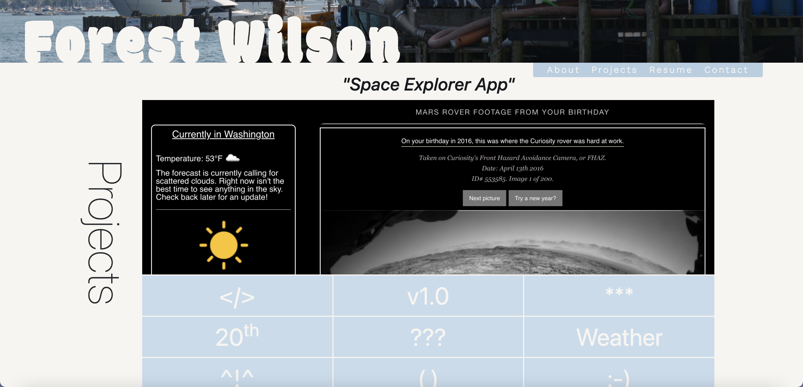
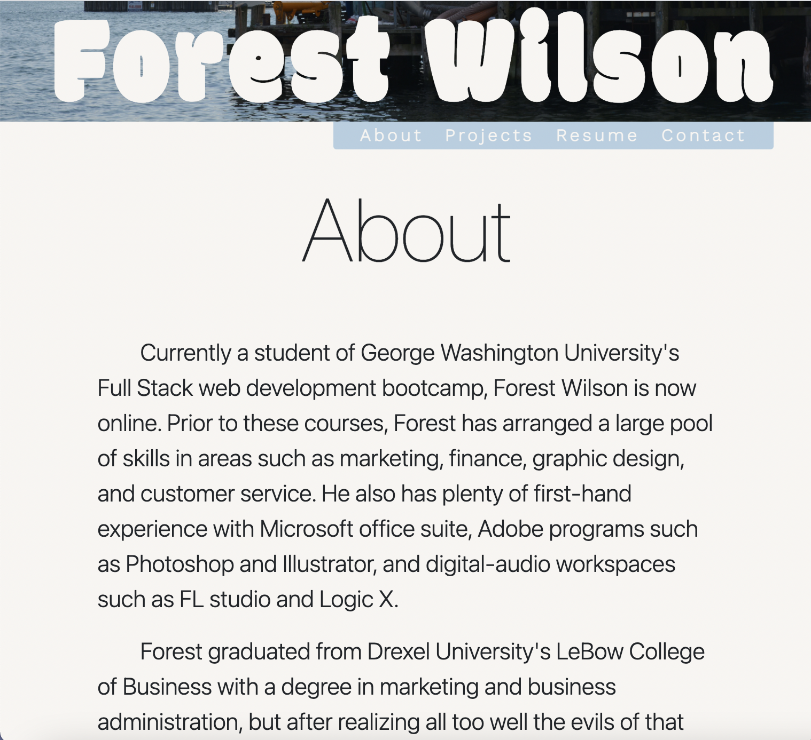

# Forest Wilson

Welcome to portfolio v2.0, because despite what I said in my about me, sometimes I am bad at keeping simple.

## Comments

When I first saw this assignemnt to update our portfolio, I thought to myself, oh, this would be a fun time to remake my portfolio site given all that i know now compared to the first time around. With bootstrap this will be quick easy and free! Well, it turns out I underestimated what I would take to get everything reactive to screen sizes and phones, let alone to fully remake everything, but I was in too deep at that point so I had to commit. *sigh*

I only ended up using bootstrap for column dimentions and breakpoints, but I think even just for this, it probably saved me hours trying to get those correct as well. 

Shoutout to my roomate for showing me position: sticky. However, this certainly led me down a rabbit-hole of debugging for my header. Thankfully I am pretty happy with how it turned out overall, apart from some irregular displays and some missing functionality I would have liked such as it remaining in its collapsed form when you start scrolling up from the bottom.

God bless margin: auto.

## Issues

There are a whole slew of things that I would have liked to add to this before submit, but I have simply spent way more time on this than I anticipated, so this will have to do.

I also had a lot of difficulty with going about displaying an image (project box specifically) in a dynamic way that still keeps the image fully in view (as opposed to the sides collapsing in). This is an issue I've had in any project that I've used images, so I'd love to really research this indepth sometime in the future.

also, sorry, no resume. I wanted to include it in this before submitting, but It is not up to date and I cant wait for that to be done before submitting this. Will update this when I have submitted that project on BCS.

* for the future
  better margin control
  better content alignment
  better body fonts
  font and box sizing that does not use vmax (although it really does wonders)
  a header that is not as complicated

## Bugs

On phone display, the header sticks to the navbar instead of the header img itself. I'm not sure why this is happening, perhaps something to do with the parend div's bottom area being reduced, but I havent figured out why it is partially working instead of not working at all.

## Screenshots

## Relevant links
[Live site](https://forestw70.github.io/Portfolio2.0/)
 
[Repo](https://github.com/ForestW70/Portfolio2.0)

